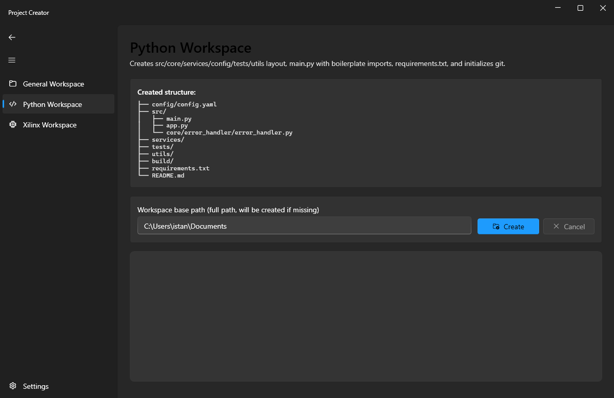

---
# PYTHON BASED WORKSPACE CREATOR

- The aim of this project is to ease the creating general workspace for the application. It contains following by now.

   
    |   Workspace Creator Name                  |        
    |   ---                                     |
    |  Python-Workspace                         |
    |  Xilinx-Workspace                         |
    |  Workspace-Workspace                      |

